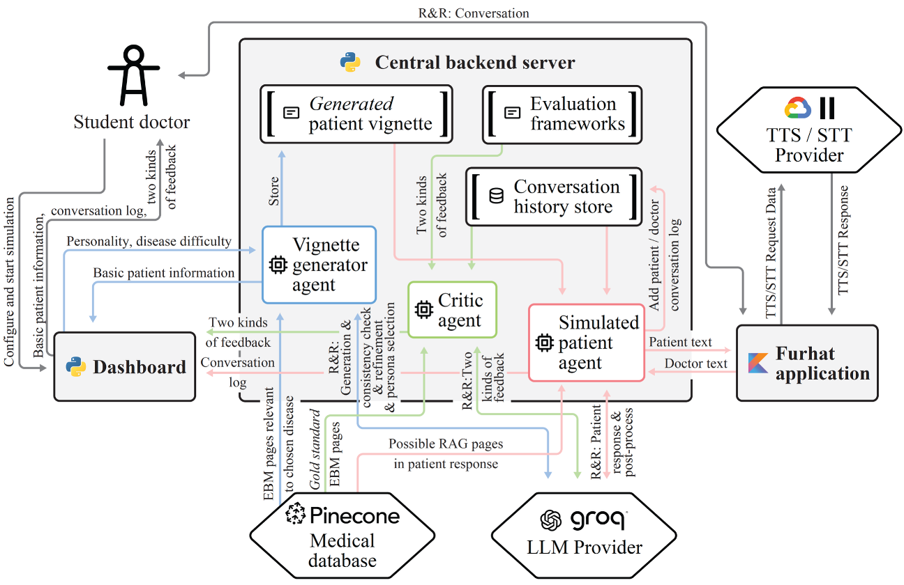

# An Agentic AI Framework for Training General Practitioner Student Skills

This repository contains the source code, installation guidelines and documentation for the paper: **"An Agentic AI Framework for Training General Practitioner Student Skills"**.

<p align="center">
  <a href="#system-architecture">System Architecture</a> •
  <a href="#repository-structure">Repository Structure</a> •
  <a href="#getting-started">Getting Started</a> •
  <a href="#disclaimer">Disclaimer</a> •
  <a href="#license">License</a> •
  <a href="#citation">Citation</a>

</p>

------

</div>

<details>
<summary><strong>Click to read the abstract</strong></summary>

Advancements in large language models offer great potential for enhancing virtual simulated patients (VSPs) in medical education, providing scalable alternatives to resource-intensive traditional methods. However, current VSPs often struggle with medical accuracy, consistent roleplaying, scenario generation for VSP use, and providing structured educational feedback. We introduce an agentic AI framework for training general practitioner student skills, embodied by a Furhat robotic head, addressing these challenges. Our system features three core agents: a generator agent creating evidence-based medicine-grounded, configurable vignettes with customizable Big Five personality; a conversational VSP agent delivering accurate, persona-driven dialogue using multi-step reasoning and retrieval-augmented generation; and a critic agent delivering automated, standards-based feedback on communication skills and clinical reasoning. Student evaluations affirmed realistic, persona-consistent dialogue and appropriate difficulty calibration, rated the example-rich feedback highly useful, and reported excellent overall usability. This integrated framework demonstrates a robust method for developing more dependable and pedagogically valuable VSP training tools by unifying controlled generation, accurate interaction, and standards-based assessment, paving the way for more sophisticated AI-driven medical training simulations.
</details>

## System Architecture

The diagram below provides a high-level overview of the system's components and data flow. For a more detailed interaction flow, please see the `docs/sequence_diagram.pdf`.



## Repository Structure

The project is organized into three main application folders, each with its own detailed README.

-   `central_backend_server/`: Contains the core agentic logic, WebSocket server, and orchestration hub.
-   `client_dashboard/`: A Python-based web interface for students to configure and interact with the simulation.
-   `furhat_application/`: The Kotlin skill that runs on the Furhat robot (or SDK) to handle voice I/O.
- 	`docs/`: Two documentation files for this repository.
-   `create_rag_storage.py`: A script to create and populate the Pinecone vector database with your medical knowledge sources for Retrieval-Augmented Generation (RAG).
-   `LICENSE`: The project is licensed under the GPL-3.0 License.

## Getting Started

Follow these instructions to set up and run the framework on your local machine.

### Prerequisites

-   **Python**: Version 3.10 or higher (tested on 3.10.17).
-   **Java**: JRE 11 is recommended (eg. OpenJDK 11.0.26).
-   **Operating System**: A Windows PC is required if you plan to use a GPU with the default Stella embedding for RAG.
-   **External Accounts**: You will need accounts and API keys for the following services:
    -   [OpenAI](https://openai.com/)
    -   [Groq](https://groq.com/)
    -   [Pinecone](https://www.pinecone.io/) (for RAG)
    -   [ElevenLabs](https://elevenlabs.io/) (for Text-to-Speech)
-   **Furhat SDK**: You need to [request and download the Furhat SDK](https://www.furhatrobotics.com/requestsdk) to run the virtual robot.

### Installation & Configuration

1.  **Clone the Repository**
    ```bash
    git clone https://github.com/Victordmz/agentic-framework-gp-skills.git
    cd agentic-framework-gp-skills
    ```

2.  **Install Python Dependencies**
    ```bash
    pip install -r central_backend_server/requirements.txt
    pip install -r client_dashboard/requirements.txt
    ```
3.  **Configure API Keys**
    Configure the API keys for OpenAI, Groq, and Pinecone within the backend server's config file.
    > **Note:** The TODO list includes moving these to environment variables. For now, direct configuration in `config.py` is required.

4.  **Set up the RAG Medical Database**

    a. Gather your Evidence-Based Medicine (EBM) sources into a single directory. The script supports `.md` files out of the box. To use other formats like PDF, you might need to modify the document loading logic in `central_backend_server/utils.py`.
    
    b. Update the configuration variables inside `create_rag_storage.py` (e.g., Pinecone API key and index name, source directory).
    
    c. Run the script to build your RAG index:
    
    ```bash
    python create_rag_storage.py
    ```
    
7.  **Configure Diseases and Patients**

    a. Configure the available diseases and their corresponding EBM sources in `central_backend_server/conversion_tables.py`.
    
    b. (Optional) Modify the list of predefined patients in `central_backend_server/predefined_patients.py` and ensure they are also added to the UI in `client_dashboard/ui_utils.py`.

## Running the Application

The framework consists of three components that must be run simultaneously: the Backend Server, the Dashboard, and the Furhat Application.

### 1. Start the Central Backend Server

The server acts as the central hub connecting all other components.

-   Navigate to the server directory: `cd central_backend_server`
-   (Optional) The default WebSocket port is `8085`. You can change this in `ws_server.py`.
-   Run the server:
    ```bash
    python ws_server.py
    ```
-   The server will be available at `ws://localhost:8085`.

### 2. Start the Client Dashboard

The dashboard is the student's primary interface for controlling the simulation.

-   Navigate to the dashboard directory: `cd client_dashboard`
-   Ensure the server address in `config.py` matches the backend server's address (default: `ws://localhost:8085`).
-   (Optional) The default dashboard port is `8501`. You can change this at the bottom of `main.py`.
-   Run the dashboard:
    ```bash
    python main.py
    ```
-   The dashboard will be available at `http://localhost:8501`.

### 3. Set up and Run the Furhat Application

This component handles the speech-to-text and text-to-speech for the virtual patient. We will assume you do not possess a physical Furhat. You can use this virtual alternative, meant for development purposes. See the application-specific README to create your own interface.

1.  **Launch the Furhat SDK**: Launch the SDK, log in with your developer account, and start the virtual robot.
2.  **Configure TTS**:
    -   Add your **ElevenLabs API key** in the SDK's web configuration interface (typically at `http://localhost:8080`).
    -   Alternatively, you can use Furhat's built-in Polly voices, but this requires changing the voice references in `central_backend_server/conversion_tables.py`, `predefined_patients.py`, and the Kotlin code (`client.kt`, replacing `ElevenlabsVoice` with `PollyNeuralVoice`).
3.  **Configure and Build the Skill**:
    -   (Optional) Ensure the server address in `furhat_application/src/main/kotlin/furhatos/app/askascientist/client.kt` matches the backend server's address (default: `ws://localhost:8085`).
    -   Build the Gradle file. A JRE 11 environment (e.g., OpenJDK 11) is recommended.
4.  **Launch the Skill**:
    -   From your IDE, run `furhatos.app.askascientist.MainKt`.
    -   For better error messages concerning the websocket connectino, you can set the VM option `Dio.ktor.development=true`.
    -   If you have a physical Furhat robot, use the VM option `-Dfurhatos.skills.brokeraddress=<Furhat IP>` to launch the skill on the device.


## Disclaimer

⚠️ **This repository is intended for research and experimentation only.** The system should not be used for real medical diagnosis or treatment advice. Do not use it in a production environment without significant refactoring and hardening.

## Future Work (Contributions Welcome!)

-   [ ] Modularize the three core agents for better separation of concerns.
-   [ ] Move all secrets and API keys to environment variables and provide a `.env.example` file.
-   [ ] Replace `print()` statements with a structured logging framework like `structlog`.
-   [ ] Implement a robust test suite with targeted unit and integration tests.
-   [ ] Harden error handling and implement automatic reconnection logic for WebSockets.
-   [ ] Refactor the heavy use of module-level globals in the server.
-   [ ] Implement transport security (WSS) and client authentication.
-   [ ] Differentiate between broadcast and targeted WebSocket messages instead of a single `broadcast_message` function.
-   [ ] Add persistence for conversation transcripts and feedback (e.g., using SQLite or Supabase).
-   [ ] Create a `Dockerfile` and `docker-compose.yml` for simplified, one-shot deployment.


## License

This project is licensed under the **GPL-3.0 License**. See the [LICENSE](LICENSE) file for details.

## Citation

If you use this codebase in academic work, please cite the companion paper:

(citation pending)
