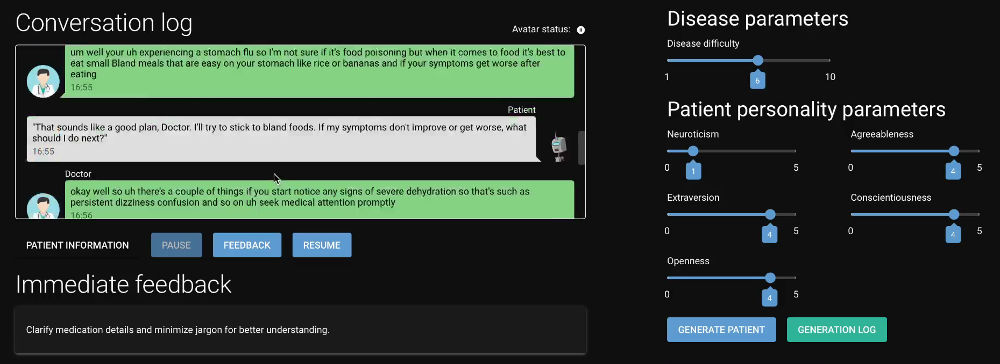

# Client Dashboard README

*Accompanies the paper **“An Agentic AI Framework for Training General‑Practitioner Student Skills”** and the top‑level project README.*

---

## 1. What the Dashboard Does 🎨

The **client dashboard** is the primary user interface for the student. Built with the Python web framework [NiceGUI](https://nicegui.io/), it provides a real-time, interactive web page to control and monitor the virtual patient simulation.

Its main responsibilities are:

*   **Scenario Configuration:** Allows the student to set the *disease difficulty* and the patient's *Big Five personality traits* (Neuroticism, Extraversion, Openness, Agreeableness, Conscientiousness).
*   **Patient Launching:** Students can either generate a new patient based on their configuration or launch one of several predefined patient scenarios.
*   **Conversation Monitoring:** Displays a live, auto-scrolling chat log of the conversation between the student (Doctor) and the virtual patient.
*   **Simulation Control:** Provides buttons to `Pause` the session (which triggers final feedback generation) and `Resume` a paused session.
*   **Feedback Display:**
    *   Shows concise, actionable "quick tips" for communication improvement during the conversation.
    *   Presents detailed, standards-based final feedback in a dialog after a session is paused, covering both communication (MIRS) and clinical reasoning.
*   **Status Tracking:** Shows the real-time status of the Furhat avatar (e.g., listening, speaking, thinking) and connection status to the backend server.



---

## 2. File/Module Tour 🗂

The dashboard is designed with a clear separation between the UI layout (`main.py`) and the UI logic/components (`ui_utils.py`).

| Path                   | What it contains                                                                                                                                                             |
| ---------------------- | ---------------------------------------------------------------------------------------------------------------------------------------------------------------------------- |
| **`main.py`**          | The application's entry point. It sets up the overall page structure (e.g., two-column layout), initializes startup hooks, and runs the NiceGUI server on port `8501`.          |
| **`ui_utils.py`**      | The heart of the UI logic. Contains all the `@ui.refreshable` components, dialog definitions, and functions that dynamically update the UI in response to WebSocket events.      |
| **`utils.py`**         | The client-side business logic and WebSocket communication handler. It manages the connection state and sends/receives JSON messages to/from the `central_backend_server`.      |
| **`config.py`**        | Holds the WebSocket server address (`WS_CONN`) and the connection retry delay.                                                                                                 |
| **`requirements.txt`** | The single Python dependency for this application: `nicegui`.                                                                                                                  |
| **`docs/`**          | Files supporting this readme.          |


> **Prototype Warning:** This application makes heavy use of module-level global variables for state management and relies on a shared `utils.py` module for backend communication. This approach is suitable for a prototype but would require significant refactoring for a production environment.

---

## 3. Running the Dashboard 🚀

To run the dashboard, ensure you have already installed the dependencies.

1.  Navigate to the dashboard directory:
    ```bash
    cd client_dashboard
    ```
2.  Make sure the `WS_CONN` in `config.py` points to your running `central_backend_server` (default is `ws://localhost:8085/`).
3.  Run the application:
    ```bash
    python main.py
    ```
4.  Open a web browser and navigate to **`http://localhost:8501`**.

The web server port can be changed by modifying the `ui.run(port=...)` call at the bottom of `main.py`.

---

## 4. Configuration Reference 🛠

The primary configuration is in `config.py`:

| Key           | Meaning                                                      |
| ------------- | ------------------------------------------------------------ |
| `WS_CONN`     | The full WebSocket URL of the central backend server.        |
| `RETRY_DELAY` | The number of seconds to wait before attempting to reconnect to the server if the connection is lost. |

---

## 5. How it Interacts with the Backend 🔌

The dashboard is a "thin client" that relies entirely on the `central_backend_server` for its logic.

1.  **Connection:** On startup (`app.on_startup`), `main.py` launches the `utils.consumer` task, which establishes and maintains a persistent WebSocket connection to the server.
2.  **Sending Actions:** When a user interacts with a UI element (e.g., clicks the "Generate patient" button), the corresponding `on_click` handler in `ui_utils.py` calls a function in `utils.py` (e.g., `utils.generate_patient`). This `utils` function then constructs a JSON message and sends it over the WebSocket.
3.  **Receiving Events:** The `utils.consumer` loop continuously listens for incoming messages from the server. When a message is received, it's parsed, and a corresponding function in `ui_utils.py` is called to update the UI (e.g., `ui_utils.add_patient_message`, `ui_utils.progress_end`, `ui_utils.update_form_fields_running_patient`). This reactive, event-driven flow ensures the UI always reflects the current state of the simulation.

---

## 6. License 📄

This dashboard inherits the repository-wide **GPL-3.0** license. See the top-level `LICENSE` file for full text.